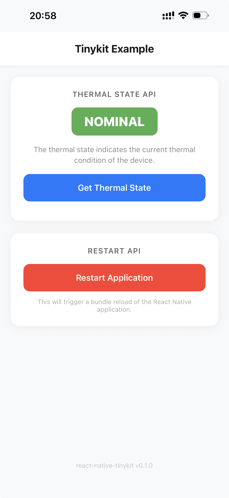

# react-native-tinykit

[](https://www.npmjs.com/package/react-native-tinykit)
[](https://github.com/luoxuhai/react-native-tinykit/blob/master/LICENSE)

A lightweight React Native toolkit for iOS, providing essential native utilities (Zero dependencies).



## Features

- 🔄 **App Restart** - Programmatically restart your React Native application
- 🌡️ **Thermal State** - Get and monitor the device's thermal state
- ⭐ **App Review** - Request App Store review from within your app
- 🔅 **Keep Awake** - Prevent the screen from auto-locking
- 📳 **Haptic Feedback** - Trigger impact, selection, and notification haptics
- 🎨 **Color Picker** - Present the native iOS color picker
- ✉️ **Mail Composer** - Present the native iOS mail composer
- 🧩 **Optional Native Features** - Compile only the native features your app uses
- ⚡ **Turbo Module** - Built with the new architecture for optimal performance
- 📦 **Lightweight** - Minimal footprint with zero dependencies

## Requirements

- React Native >= 0.76
- iOS >= 16.0

## Installation

```sh
# Using npm
npm install react-native-tinykit

# Using yarn
yarn add react-native-tinykit
```

### iOS Setup

```sh
cd ios && pod install
```

All native features are enabled by default, so no additional configuration is
required.

#### Optional native feature selection

To reduce the native code compiled into your app, add the features you use to
your app's `package.json`:

```json
{
  "react-native-tinykit": {
    "features": ["Haptics", "KeepAwake"]
  }
}
```

Available features:

- `Restart`
- `ThermalState`
- `Review`
- `KeepAwake`
- `ColorPicker`
- `Haptics`
- `Mail`

Use an empty `features` array to compile only the TurboModule core. Run
`pod install` again whenever this list changes. Calling most APIs whose native
feature was not selected throws an error that names the missing feature.
`openMail` instead falls back to the system `mailto:` URL.

Feature-specific JavaScript entry points are also available:

```tsx
import { impact } from 'react-native-tinykit/haptics';
import { activate } from 'react-native-tinykit/keep-awake';
import { openMail } from 'react-native-tinykit/mail';
```

The root `react-native-tinykit` imports remain supported for backwards
compatibility. JavaScript entry points provide cleaner dependency boundaries;
`react-native-tinykit.features` controls which native source files are compiled.

## Usage

### Restart Application

Restart the React Native application programmatically:

```tsx
import { restart } from 'react-native-tinykit';

// Restart the app
restart();
```

#### Example Use Cases

- Force reload after language/locale change
- Reset app state after logout
- Apply configuration changes that require a restart

### Thermal State

Get the current thermal state and monitor for changes:

```tsx
import { getThermalState, onThermalStateChange } from 'react-native-tinykit';

// Get current thermal state
const state = getThermalState();
console.log('Current thermal state:', state);

// Listen for thermal state changes
const subscription = onThermalStateChange((state) => {
  console.log('Thermal state changed:', state);

  switch (state) {
    case 'nominal':
      // Normal operating conditions
      break;
    case 'fair':
      // Slightly elevated thermal state
      break;
    case 'serious':
      // High thermal state - consider reducing activity
      break;
    case 'critical':
      // Critical thermal state - reduce activity immediately
      break;
  }
});

// Clean up the listener when done
subscription.remove();
```

#### Example Use Cases

- Reduce graphics quality or frame rate when device is overheating
- Pause background tasks during high thermal states
- Show warnings to users when thermal state is critical

### Keep Awake

Prevent the screen from auto-locking:

```tsx
import {
  activate,
  deactivate,
  useKeepAwake,
  KeepAwake,
} from 'react-native-tinykit';

// Imperative API
activate(); // Keep screen awake
deactivate(); // Allow screen to auto-lock

// Hook - keeps screen awake while the component is mounted
function VideoPlayer() {
  useKeepAwake();
  return <Video />;
}

// Component - keeps screen awake while mounted
function App() {
  return (
    <>
      <KeepAwake />
      <MyContent />
    </>
  );
}
```

#### Example Use Cases

- Keep the screen on during video playback
- Prevent auto-lock during navigation or long-running tasks
- Keep display active during presentations or reading

### Haptic Feedback

Trigger haptic feedback with three types of generators:

```tsx
import { impact, selection, notification } from 'react-native-tinykit';

// Impact feedback - physical "tap" sensation
impact('light');
impact('medium');
impact('heavy');
impact('soft');
impact('rigid');

// Selection feedback - subtle "tick" for selection changes
selection();

// Notification feedback - communicates success, warning, or error
notification('success');
notification('warning');
notification('error');
```

#### Example Use Cases

- Provide tactile feedback on button press or toggle
- Indicate state changes with selection haptics
- Communicate action results (success/failure) with notification haptics

### App Review

Request an App Store review from your user:

```tsx
import { requestReview } from 'react-native-tinykit';

// Request review
await requestReview();
```

> **Note**: In development mode, the review dialog will always appear. In production (TestFlight/App Store), iOS limits the frequency of these prompts (max 3 times per year per user).

#### Example Use Cases

- Prompt for review after a user completes a significant action
- Ask for feedback after a certain number of app opens

### Color Picker

Present the native iOS color picker:

```tsx
import { showColorPicker } from 'react-native-tinykit';

const result = await showColorPicker({
  selectedColor: '#007AFF',
  supportsAlpha: true,
  supportsEyedropper: true,
  maximumLinearExposure: 1,
  title: 'Pick a Color',
  showDoneButton: true,
  detents: [
    { type: 'custom', identifier: 'compact', height: 420 },
    { type: 'large' },
  ],
  selectedDetentIdentifier: 'compact',
  prefersGrabberVisible: true,
});

console.log(result.color); // #RRGGBBAA
```

### Mail Composer

Present the built-in iOS mail composer without leaving your app:

```tsx
import { openMail } from 'react-native-tinykit';

const result = await openMail({
  subject: 'Feedback',
  recipients: ['support@example.com'],
  body: '<p>Hello from TinyKit</p>',
  isHTML: true,
  attachments: [
    {
      path: reportPath,
      mimeType: 'application/pdf',
      name: 'report.pdf',
    },
  ],
});

console.log(result); // sent, saved, cancelled, or opened
```

## API Reference

### `restart()`

Triggers a reload of the React Native application.

```tsx
restart(): void
```

**Example:**

```tsx
import { restart } from 'react-native-tinykit';

const handleLogout = async () => {
  await clearUserData();
  restart(); // Restart app to reset state
};
```

### `getThermalState()`

Returns the current thermal state of the device.

```tsx
getThermalState(): ThermalState
```

**Returns:** `'nominal' | 'fair' | 'serious' | 'critical'`

| State      | Description                               |
| ---------- | ----------------------------------------- |
| `nominal`  | The thermal state is within normal limits |
| `fair`     | The thermal state is slightly elevated    |
| `serious`  | The thermal state is high                 |
| `critical` | The thermal state is critically high      |

**Example:**

```tsx
import { getThermalState } from 'react-native-tinykit';

const state = getThermalState();
if (state === 'critical') {
  // Reduce app activity to help cool down the device
}
```

### `onThermalStateChange()`

Adds a listener for thermal state changes.

```tsx
onThermalStateChange(listener: (state: ThermalState) => void): { remove: () => void }
```

**Parameters:**

- `listener` - Callback function that receives the new thermal state

**Returns:** A subscription object with a `remove()` method to stop listening

**Example:**

```tsx
import { onThermalStateChange } from 'react-native-tinykit';

const subscription = onThermalStateChange((state) => {
  console.log('Thermal state changed to:', state);
});

// Later, when you want to stop listening:
subscription.remove();
```

### `activate()`

Activates the keep-awake feature, preventing the screen from auto-locking.

```tsx
activate(): void
```

**Example:**

```tsx
import { activate } from 'react-native-tinykit';

activate();
```

### `deactivate()`

Deactivates the keep-awake feature, allowing the screen to auto-lock.

```tsx
deactivate(): void
```

**Example:**

```tsx
import { deactivate } from 'react-native-tinykit';

deactivate();
```

### `useKeepAwake()`

A hook that keeps the screen awake while the component is mounted. Automatically deactivates on unmount.

```tsx
useKeepAwake(): void
```

**Example:**

```tsx
import { useKeepAwake } from 'react-native-tinykit';

function VideoPlayer() {
  useKeepAwake();
  return <Video />;
}
```

### `<KeepAwake />`

A component that keeps the screen awake while mounted. Renders nothing.

```tsx
<KeepAwake />
```

**Example:**

```tsx
import { KeepAwake } from 'react-native-tinykit';

function App() {
  const [isPlaying, setIsPlaying] = useState(false);
  return (
    <>
      {isPlaying && <KeepAwake />}
      <VideoPlayer onPlay={() => setIsPlaying(true)} />
    </>
  );
}
```

### `impact()`

Triggers an impact haptic feedback.

```tsx
impact(style: ImpactFeedbackStyle): void
```

**Parameters:**

- `style` - The style of the impact feedback

| Style    | Description                    |
| -------- | ------------------------------ |
| `light`  | A light, subtle impact         |
| `medium` | A medium impact (default feel) |
| `heavy`  | A heavy, strong impact         |
| `soft`   | A soft, gentle impact          |
| `rigid`  | A rigid, firm impact           |

**Example:**

```tsx
import { impact } from 'react-native-tinykit';

const handlePress = () => {
  impact('medium');
};
```

### `selection()`

Triggers a selection haptic feedback. Use this for selection changes like picking a value.

```tsx
selection(): void
```

**Example:**

```tsx
import { selection } from 'react-native-tinykit';

const handleSelectionChange = () => {
  selection();
};
```

### `notification()`

Triggers a notification haptic feedback to communicate successes, failures, or warnings.

```tsx
notification(type: NotificationFeedbackType): void
```

**Parameters:**

- `type` - The type of notification feedback

| Type      | Description                             |
| --------- | --------------------------------------- |
| `success` | Indicates a task completed successfully |
| `warning` | Indicates a warning or caution          |
| `error`   | Indicates an error or failure           |

**Example:**

```tsx
import { notification } from 'react-native-tinykit';

const handleSubmit = async () => {
  try {
    await submitForm();
    notification('success');
  } catch {
    notification('error');
  }
};
```

### `requestReview()`

Requests a review of the app.

```tsx
requestReview(): Promise<void>
```

**Returns:** A Promise that resolves when the request is processed.

**Example:**

```tsx
import { requestReview } from 'react-native-tinykit';

const handleReview = async () => {
  try {
    await requestReview();
  } catch (error) {
    console.error('Failed to request review:', error);
  }
};
```

### `showColorPicker()`

Shows the native iOS `UIColorPickerViewController`.

```tsx
showColorPicker(options?: ColorPickerOptions): Promise<ColorPickerResult>
```

**Options:**

| Option                            | Type                  | Description                                                                      |
| --------------------------------- | --------------------- | -------------------------------------------------------------------------------- |
| `selectedColor`                   | `string`              | Initial color. Supports `#RGB`, `#RGBA`, `#RRGGBB`, and `#RRGGBBAA`.             |
| `supportsAlpha`                   | `boolean`             | Shows the alpha slider. Defaults to `true`.                                      |
| `supportsEyedropper`              | `boolean`             | Enables eyedropper support when available on the OS.                             |
| `maximumLinearExposure`           | `number`              | Maximum linear exposure when available on the OS.                                |
| `title`                           | `string`              | Optional picker title.                                                           |
| `showDoneButton`                  | `boolean`             | Shows a top-right Done button.                                                   |
| `doneButtonTitle`                 | `string`              | Custom title for the Done button.                                                |
| `detents`                         | `ColorPickerDetent[]` | Sheet detents. Supports `medium`/`large` and custom `height`/`fraction` detents. |
| `selectedDetentIdentifier`        | `string`              | Initially selected detent. Use `medium`, `large`, or a custom detent identifier. |
| `largestUndimmedDetentIdentifier` | `string`              | Largest detent that keeps the presenting view undimmed.                          |
| `prefersGrabberVisible`           | `boolean`             | Shows the sheet grabber.                                                         |

```tsx
type ColorPickerDetent = {
  type: 'medium' | 'large' | 'custom';
  identifier?: string;
  height?: number; // custom height in points
  fraction?: number; // custom fraction of maximum sheet height
};
```

**Returns:** A Promise resolving to:

```tsx
type ColorPickerResult = {
  color: string; // #RRGGBBAA
  red: number;
  green: number;
  blue: number;
  alpha: number;
};
```

### `canSendMail()`

Returns whether the current device is configured to send mail with the native
iOS mail composer. Returns `false` when the `Mail` native feature was not
selected.

```tsx
canSendMail(): boolean
```

### `openMail()`

Shows the native iOS `MFMailComposeViewController` when available. Otherwise,
opens `mailto:` with the first value in `recipients`.

```tsx
openMail(options?: MailOptions): Promise<'sent' | 'saved' | 'cancelled' | 'opened'>
```

**Options:**

| Option          | Type               | Description                              |
| --------------- | ------------------ | ---------------------------------------- |
| `subject`       | `string`           | Initial email subject.                   |
| `recipients`    | `string[]`         | Initial To recipients.                   |
| `ccRecipients`  | `string[]`         | Initial Cc recipients.                   |
| `bccRecipients` | `string[]`         | Initial Bcc recipients.                  |
| `body`          | `string`           | Initial email body.                      |
| `isHTML`        | `boolean`          | Whether `body` contains HTML.            |
| `attachments`   | `MailAttachment[]` | Local files attached to the email draft. |

```tsx
type MailAttachment = {
  path?: string; // Absolute local path; use either path or uri
  uri?: string; // Local file URI
  type?: string; // File extension or MIME type
  mimeType?: string; // Explicit MIME type; takes precedence over type
  name?: string; // File name shown in the composer
};
```

`openMail` rejects when another composer is already open, an attachment cannot
be read, or the system cannot open the fallback URL. Attachments must use a
local path or a `file://` URI. The `mailto:` fallback only receives the first
recipient; the remaining options and attachments are not forwarded.

## Apps Using This Library

- [Night Vision - LiDAR Camera](https://apps.apple.com/app/id1668629667)
- [Laser Measure - LiDAR Powered](https://apps.apple.com/app/id6466744678)
- [PhoneAway - Digital Detox](https://apps.apple.com/app/id6744548607)
- [Fatigue Alert - Stay Awake](https://apps.apple.com/app/id6479893638)

## Contributing

See the [contributing guide](CONTRIBUTING.md) to learn how to contribute to the repository and the development workflow.

- [Development workflow](CONTRIBUTING.md#development-workflow)
- [Sending a pull request](CONTRIBUTING.md#sending-a-pull-request)
- [Code of conduct](CODE_OF_CONDUCT.md)

## License

MIT © [Darkce](https://github.com/luoxuhai)

---

Made with [create-react-native-library](https://github.com/callstack/react-native-builder-bob)
