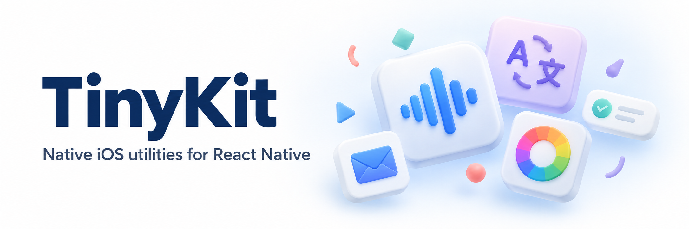

# react-native-tinykit

[](https://www.npmjs.com/package/react-native-tinykit)
[](LICENSE)

A modular collection of native iOS utilities for React Native's New
Architecture. TinyKit brings system APIs, status overlays, and small everyday
interactions to TypeScript, with native features you can include individually.

## Features

| Feature                        | What it does                                                  |
| ------------------------------ | ------------------------------------------------------------- |
| [Restart](#restart)            | Reload the React Native application                           |
| [ThermalState](#thermal-state) | Read and monitor the device's thermal state                   |
| [Review](#app-review)          | Request an App Store review                                   |
| [KeepAwake](#keep-awake)       | Prevent automatic screen locking                              |
| [Haptics](#haptics)            | Trigger impact, selection, and notification feedback          |
| [ColorPicker](#color-picker)   | Present the native iOS color picker                           |
| [Mail](#mail)                  | Compose mail with attachments or open a mail app              |
| [Toast](#toast)                | Show compact SPIndicator notifications                        |
| [Alert](#alert)                | Show SPAlert status overlays and loading indicators           |
| [Confetti](#confetti)          | Start and stop SPConfetti celebrations                        |
| [Translation](#translation)    | Present Apple's translation panel and return replacement text |

[Installation](#installation) · [Quick start](#quick-start) · [Example app](#example-app) · [Migration](#migration)

## Philosophy

TinyKit keeps its scope focused: native iOS capabilities, small JavaScript APIs,
and explicit control over what your app compiles.

| Design choice           | How TinyKit applies it                                                                                                                                                        |
| ----------------------- | ----------------------------------------------------------------------------------------------------------------------------------------------------------------------------- |
| Native integration      | TurboModules connect TypeScript to iOS implementations. System features use native APIs; Translation uses Apple's SwiftUI presentation API.                                   |
| Runtime dependencies    | No additional JavaScript runtime dependencies beyond `react` and `react-native`. No Expo or Nitro Modules runtime is required.                                                |
| Selective inclusion     | Named exports let your bundler handle JavaScript tree shaking when enabled. An explicit native feature list excludes unused implementations and their framework requirements. |
| Optional third-party UI | Toast, Alert, and Confetti use the original SPIndicator, SPAlert, and SPConfetti libraries. Their Pods are installed only when selected.                                      |
| Focused support         | iOS 17+ and the New Architecture. Android, web, and the legacy bridge are not supported targets.                                                                              |

To reduce native build size, configure
[`react-native-tinykit.features`](#optional-native-feature-selection). All native
features are enabled by default. The shared TurboModule core and Codegen remain
in the build; size savings come from excluding unused native implementations
and dependencies. Final app size also depends on bundler and linker settings.

## Requirements

- React Native with the New Architecture enabled
- iOS 17 or newer
- `react` and `react-native` as peer dependencies

The optional `Translation` feature requires a **physical iPhone or iPad running
iOS 17.4 or later**. Check `Translation.isSupported()` before presenting it;
the simulator and Mac Catalyst are not supported by this feature.

## Installation

```sh
npm install react-native-tinykit
# or: yarn add react-native-tinykit
```

Choose your native features, configure the overlay Pods if needed, then run
`pod install` and rebuild the iOS app.

### Optional native feature selection

List the features you use in your **app's** `package.json`:

```json
{
  "react-native-tinykit": {
    "features": ["Haptics", "KeepAwake"]
  }
}
```

Use the feature names from the [catalog](#features), with the same spelling and
capitalization. Omitting the configuration enables all features; an empty
`features` array compiles only the TurboModule core. Run `pod install` and
rebuild whenever the list changes.

Most APIs throw or reject with a missing-feature error when their native
implementation is excluded. `canSendMail()` returns `false` and `openMail()`
falls back to `mailto:` when `Mail` is excluded. `Translation.isSupported()`
returns `false` when `Translation` is excluded.

### iOS setup

If `Toast`, `Alert`, or `Confetti` is enabled, including with the default
configuration, load the Podfile helper and call it inside your app target,
**before `use_native_modules!`**:

```ruby
# Resolve from the app, including in hoisted/monorepo installations.
require Pod::Executable.execute_command('node', ['-p',
  "require.resolve('react-native-tinykit/scripts/overlay_pods.rb', { paths: [process.argv[1]] })",
  __dir__
]).strip

target 'YourApp' do
  tinykit_overlay_pods!(app_path: File.expand_path('..', __dir__))
  config = use_native_modules!
  # Keep your existing use_react_native! and post_install configuration.
end
```

The helper reads the same feature list and installs only the selected overlay
Pods. Omit it when all three overlay features are excluded, as in the
`Haptics` / `KeepAwake` configuration above.

```sh
cd ios && pod install
```

<details>
<summary>Overlay source pins and Podfile.lock versions</summary>

The [Podfile helper](scripts/overlay_pods.rb) pins the original upstream Git
releases. Their podspec versions differ from their source tags:

| Feature    | Library     | Git tag | Podspec version |
| ---------- | ----------- | ------- | --------------- |
| `Toast`    | SPIndicator | `1.6.5` | `1.6.4`         |
| `Alert`    | SPAlert     | `5.1.9` | `5.1.8`         |
| `Confetti` | SPConfetti  | `1.4.2` | `1.4.0`         |

The older version labels in `Podfile.lock` are expected. `CHECKOUT OPTIONS`
records the actual source tags. The helper is needed to obtain these pinned
sources instead of the CocoaPods registry releases. No upstream Swift code is
copied or modified.

</details>

### JavaScript imports

**Recommended:** use named imports from the package root:

```tsx
import { impact, useKeepAwake, Translation } from 'react-native-tinykit';
```

The package provides ES module exports, so bundlers with tree shaking enabled
can automatically remove unused JavaScript exports. Tree shaking depends on
your bundler and build configuration; feature-specific import paths are optional:

```tsx
import { impact } from 'react-native-tinykit/haptics';
```

JavaScript tree shaking does not select native source files. Configure
`react-native-tinykit.features` separately to control native compilation.

## Quick start

With `Haptics` enabled and the app rebuilt:

```tsx
import { Button } from 'react-native';
import { impact } from 'react-native-tinykit';

export default function App() {
  return <Button title="Try haptics" onPress={() => impact('light')} />;
}
```

## Restart

`restart(): void` triggers a reload of the React Native application, for example
after applying a configuration change. It does not relaunch the iOS process or
clear persisted data.

```tsx
import { restart } from 'react-native-tinykit';

restart();
```

## Thermal State

Read the current state synchronously, or subscribe to changes:

```tsx
import { getThermalState, onThermalStateChange } from 'react-native-tinykit';

const state = getThermalState();

const subscription = onThermalStateChange((nextState) => {
  console.log('Thermal state:', nextState);
});

// Remove the listener when it is no longer needed.
subscription.remove();
```

| API                              | Returns              |
| -------------------------------- | -------------------- |
| `getThermalState()`              | `ThermalState`       |
| `onThermalStateChange(listener)` | `{ remove(): void }` |

`ThermalState` is `'nominal' | 'fair' | 'serious' | 'critical'`, from normal
conditions to the highest thermal pressure. Use it to adjust resource-intensive
work. Native monitoring starts with the first listener and stops when the last
listener is removed.

## App Review

`requestReview(): Promise<void>` asks StoreKit to present an App Store review
prompt:

```tsx
import { requestReview } from 'react-native-tinykit';

await requestReview();
```

The Promise resolves after the request is submitted, without reporting whether
a prompt appeared or a review was submitted. The system controls presentation;
follow Apple's [review request guidance](https://developer.apple.com/documentation/storekit/requesting-app-store-reviews)
when choosing when to call it.

## Keep Awake

Use the hook to prevent automatic screen locking while a screen is mounted:

```tsx
import { Text } from 'react-native';
import { useKeepAwake } from 'react-native-tinykit';

function ReadingScreen() {
  useKeepAwake();
  return <Text>The screen stays awake while this view is mounted.</Text>;
}
```

| API                    | Behavior                                                         |
| ---------------------- | ---------------------------------------------------------------- |
| `activate(): void`     | Disable automatic screen locking                                 |
| `deactivate(): void`   | Allow automatic screen locking again                             |
| `useKeepAwake(): void` | Activate on mount and deactivate on unmount                      |
| `<KeepAwake />`        | Render nothing and apply the same lifecycle behavior as the hook |

These APIs change the app-wide idle timer. They are not reference counted:
unmounting one keep-awake consumer can deactivate another. Use a single owner
when multiple screens need to coordinate this state.

## Haptics

Trigger native impact, selection, and notification feedback:

```tsx
import { impact, selection, notification } from 'react-native-tinykit';

impact('light');
selection();
notification('success');
```

| API                        | Accepted values                                       |
| -------------------------- | ----------------------------------------------------- |
| `impact(style): void`      | `'light'`, `'medium'`, `'heavy'`, `'soft'`, `'rigid'` |
| `selection(): void`        | No arguments                                          |
| `notification(type): void` | `'success'`, `'warning'`, `'error'`                   |

The corresponding TypeScript types are `ImpactFeedbackStyle` and
`NotificationFeedbackType`.

## Color Picker

`showColorPicker(options?): Promise<ColorPickerResult>` presents the native
`UIColorPickerViewController` and returns the selected color when it closes.

```tsx
import { showColorPicker } from 'react-native-tinykit';

const result = await showColorPicker({
  selectedColor: '#007AFF',
  supportsAlpha: true,
  title: 'Pick a color',
  showDoneButton: true,
  detents: [
    { type: 'custom', identifier: 'compact', height: 420 },
    { type: 'large' },
  ],
  selectedDetentIdentifier: 'compact',
  prefersGrabberVisible: true,
});

console.log(result.color); // #RRGGBBAA
```

| Option                            | Type                  | Description                                                                      |
| --------------------------------- | --------------------- | -------------------------------------------------------------------------------- |
| `selectedColor`                   | `string`              | Initial color. Supports `#RGB`, `#RGBA`, `#RRGGBB`, and `#RRGGBBAA`.             |
| `supportsAlpha`                   | `boolean`             | Shows the alpha slider. Defaults to `true`.                                      |
| `supportsEyedropper`              | `boolean`             | Enables eyedropper support when available on the OS.                             |
| `maximumLinearExposure`           | `number`              | Maximum linear exposure when available on the OS.                                |
| `title`                           | `string`              | Optional picker title.                                                           |
| `showDoneButton`                  | `boolean`             | Shows a top-right Done button.                                                   |
| `doneButtonTitle`                 | `string`              | Custom title for the Done button.                                                |
| `detents`                         | `ColorPickerDetent[]` | Sheet detents. Supports `medium`/`large` and custom `height`/`fraction` detents. |
| `selectedDetentIdentifier`        | `string`              | Initially selected detent. Use `medium`, `large`, or a custom detent identifier. |
| `largestUndimmedDetentIdentifier` | `string`              | Largest detent that keeps the presenting view undimmed.                          |
| `prefersGrabberVisible`           | `boolean`             | Shows the sheet grabber.                                                         |

```tsx
type ColorPickerDetent = {
  type: 'medium' | 'large' | 'custom';
  identifier?: string;
  height?: number; // custom height in points
  fraction?: number; // custom fraction of maximum sheet height
};
```

The result contains a hex string and individual color channels:

```tsx
type ColorPickerResult = {
  color: string; // #RRGGBBAA
  red: number;
  green: number;
  blue: number;
  alpha: number;
};
```

## Mail

`openMail(options?): Promise<MailResult>` presents the native
`MFMailComposeViewController` when the device is configured to send mail.
`canSendMail(): boolean` lets you check availability first.

```tsx
import { openMail } from 'react-native-tinykit';

const result = await openMail({
  subject: 'Feedback',
  recipients: ['support@example.com'],
  body: '<p>Hello from TinyKit</p>',
  isHTML: true,
});

console.log(result); // 'sent', 'saved', 'cancelled', or 'opened'
```

| Option          | Type               | Description                              |
| --------------- | ------------------ | ---------------------------------------- |
| `subject`       | `string`           | Initial email subject.                   |
| `recipients`    | `string[]`         | Initial To recipients.                   |
| `ccRecipients`  | `string[]`         | Initial Cc recipients.                   |
| `bccRecipients` | `string[]`         | Initial Bcc recipients.                  |
| `body`          | `string`           | Initial email body.                      |
| `isHTML`        | `boolean`          | Whether `body` contains HTML.            |
| `attachments`   | `MailAttachment[]` | Local files attached to the email draft. |

```tsx
type MailAttachment = {
  path?: string; // Absolute local path; use either path or uri
  uri?: string; // Local file URI
  type?: string; // File extension or MIME type
  mimeType?: string; // Explicit MIME type; takes precedence over type
  name?: string; // File name shown in the composer
};
```

When the native composer is unavailable, including when `Mail` is excluded,
`openMail` opens `mailto:` with the first recipient and returns `'opened'`.

`openMail` rejects when another composer is already open, an attachment cannot
be read, or the system cannot open the fallback URL. Attachments must use a
local path or a `file://` URI. The `mailto:` fallback only receives the first
recipient; the remaining options and attachments are not forwarded.

## Toast

`Toast.show(options?): Promise<void>` presents a compact SPIndicator toast:

```tsx
import { Toast } from 'react-native-tinykit';

await Toast.show({
  title: 'Saved',
  message: 'Your changes are ready',
  icon: 'done',
  haptic: 'success',
});
```

| Option    | Type                                          | Default  |
| --------- | --------------------------------------------- | -------- |
| `title`   | `string`                                      | `''`     |
| `message` | `string`                                      | `''`     |
| `icon`    | `'done' \| 'error'`                           | `'done'` |
| `haptic`  | `'success' \| 'warning' \| 'error' \| 'none'` | `'none'` |

Toast uses SPIndicator's default duration. Its public option type is
`ToastOptions`. See [overlay behavior](#overlay-behavior) for shared lifecycle
and Promise semantics.

## Alert

`Alert.show(options?): Promise<void>` presents an SPAlert status overlay.
Use it for success states and progress indicators:

```tsx
import { Alert } from 'react-native-tinykit';

await Alert.show({ title: 'Done', icon: 'heart', duration: 2000 });

// A persistent spinner, dismissed from a later action.
await Alert.show({ title: 'Loading', icon: 'spinner', duration: 0 });
await Alert.dismissAll();
```

| Option     | Type                                          | Default  |
| ---------- | --------------------------------------------- | -------- |
| `title`    | `string`                                      | `''`     |
| `message`  | `string`                                      | `''`     |
| `icon`     | `'done' \| 'error' \| 'spinner' \| 'heart'`   | `'done'` |
| `haptic`   | `'success' \| 'warning' \| 'error' \| 'none'` | `'none'` |
| `duration` | Finite number, in milliseconds                | `2000`   |

A duration of zero or less disables automatic dismissal, including for
spinners. `Alert.dismissAll(): Promise<void>` dismisses all TinyKit alerts.
The standalone `dismissAll` export is also available.

`Alert` is a status overlay, not a confirmation dialog. Alias the import if you
also use React Native's `Alert`. Its public option type is `AlertOptions`.

## Confetti

Start the original SPConfetti full-width downward animation, using arc, star,
heart, and triangle particles:

```tsx
import { Confetti } from 'react-native-tinykit';

await Confetti.start({ duration: 2000 });

// From a later action, stop emitting particles early.
await Confetti.stop();
```

`Confetti.start(options?): Promise<void>` accepts `duration` in milliseconds,
defaulting to `2000`. The value must be finite and non-negative. Starting again
replaces the stop timer. `Confetti.stop(): Promise<void>` stops new particles;
existing particles finish their animation. The public option type is
`ConfettiOptions`.

### Overlay behavior

Toast, Alert, and Confetti require the [Podfile helper](#ios-setup) when enabled.
Their methods resolve after the native presentation, dismissal, or animation
request is made on the main thread, **not after the animation finishes**.
Presentation rejects if no window is available; excluded features reject with
a missing-feature error. Active overlays are cleaned up when the native module
is invalidated.

Toast and Alert haptics use `OverlayHaptic` and do not require the separate
`Haptics` feature.

## Translation

Present Apple's system translation panel, with an optional action to return
replacement text to your app:

```tsx
import { Translation } from 'react-native-tinykit';

if (Translation.isSupported()) {
  const result = await Translation.present({
    text: 'Hello, world! 👋',
    allowsReplacement: true,
  });
  if (result.status === 'replaced') {
    console.log(result.translatedText);
  }
}

// From another action, close the active panel. Safe if none is open.
await Translation.dismiss();
```

| API                            | Behavior                                                                                                                                                 |
| ------------------------------ | -------------------------------------------------------------------------------------------------------------------------------------------------------- |
| `Translation.isSupported()`    | Returns false if the native feature is excluded, on the simulator, on Mac Catalyst, or before iOS 17.4                                                   |
| `Translation.present(options)` | Resolves when the panel closes: `{ status: 'dismissed' }`, or `{ status: 'replaced', translatedText: string }` when the user chooses Replace Translation |
| `Translation.dismiss()`        | Closes the current panel and resolves its pending `present` call with `dismissed`                                                                        |

The equivalent named exports are `isTranslationSupported`, `showTranslation`
and `dismissTranslation`.

| Option              | Type                                           | Description                                                                                                    |
| ------------------- | ---------------------------------------------- | -------------------------------------------------------------------------------------------------------------- |
| `text`              | `string`                                       | Required, non-empty text. Unicode, emoji and whitespace are preserved.                                         |
| `allowsReplacement` | `boolean`                                      | Defaults to `false`. Offers Apple's Replace Translation action; your app decides how to use the returned text. |
| `targetViewNode`    | native view `ref.current` or React tag         | Optional anchor for the iPad popover. The view must be mounted and visible.                                    |
| `anchor`            | `{ x, y, width, height }`                      | Alternative to `targetViewNode`: rectangle in window coordinates, in points.                                   |
| `arrowEdge`         | `'top' \| 'bottom' \| 'leading' \| 'trailing'` | Preferred popover arrow edge. Defaults to `'top'`; the system may adjust placement.                            |

For example, attach the iPad popover to the text being translated:

```tsx
import { useRef, type ComponentRef } from 'react';
import { Text, Button } from 'react-native';
import { Translation } from 'react-native-tinykit';

function TranslatableText({ text }: { text: string }) {
  const textRef = useRef<ComponentRef<typeof Text>>(null);
  return (
    <>
      <Text ref={textRef}>{text}</Text>
      <Button
        title="Translate"
        disabled={!Translation.isSupported()}
        onPress={() => {
          Translation.present({ text, targetViewNode: textRef.current }).catch(
            console.error
          );
        }}
      />
    </>
  );
}
```

Pass either `anchor` or `targetViewNode`, not both. Without an anchor, the popover
uses the presenting view's center. An unmounted, empty, or offscreen target
rejects with `E_TRANSLATION_INVALID_ANCHOR`.
Only one panel may be open at a time; another call rejects with
`E_TRANSLATION_ALREADY_PRESENTED`. Unsupported devices reject with
`E_TRANSLATION_UNAVAILABLE`. Invalid text rejects with `E_TRANSLATION_INVALID_TEXT`;
an unavailable presenter rejects with `E_TRANSLATION_NO_PRESENTER`. Invalid
option values reject with `E_TRANSLATION_INVALID_OPTIONS`; module invalidation
rejects a pending presentation with `E_TRANSLATION_CANCELLED`.

This uses Apple's public
[`translationPresentation`](<https://developer.apple.com/documentation/swiftui/view/translationpresentation(ispresented:text:attachmentanchor:arrowedge:replacementaction:)>)
API. The user chooses languages in the system panel, which may ask to download
language models. Closing or copying in the panel does not return translated text;
only Replace Translation does. This API presents system UI and does not offer
background or batch translation. Apple requires a real device to test translation
([WWDC24](https://developer.apple.com/videos/play/wwdc2024/10117/)).

## Migration

### From react-native-ios-translation

Use the `Translation` API from the package root:

```tsx
import { Translation } from 'react-native-tinykit';

const result = await Translation.present({ text: 'Hello' });
// result is now TranslationResult, replacing the old Promise<number> type.
```

The original named `present` export remains available from
`react-native-tinykit/translation` for compatibility.

Add `Translation` to your app's feature list if configured, remove the old package,
then run `pod install` and rebuild. TinyKit replaces the original private selector
with the public API, preserves emoji, and completes the previously unresolved
Promise. The minimum OS for this feature changes from iOS 15 to iOS 17.4.
The migration is based on
[`react-native-ios-translation` 0.2.2](https://github.com/luoxuhai/react-native-ios-translation/tree/bde5bf029c4e1d07ce45300bae569f834fa16211);
its MIT notice is retained in [`ios/Translation/LICENSE`](ios/Translation/LICENSE).

### From `@react-native-library/overlay`

Change the import to `react-native-tinykit` and add the Podfile helper above.
The `Toast.show`, `Alert.show`, `Alert.dismissAll`, `Confetti.start` and
`Confetti.stop` APIs retain their names and millisecond duration units. The
standalone `dismissAll` export is also retained. The old overlay README's
`Confetti.show` example was incorrect; the actual API is `Confetti.start`.

Public option types are available as `ToastOptions`, `AlertOptions`,
`ConfettiOptions` and `OverlayHaptic`.

## Example App

The [example app](example/src/App.tsx) demonstrates native utilities, overlays,
and Translation. From the repository root:

```sh
yarn
```

Install the example's Pods:

```sh
cd example/ios && pod install
```

Then run Metro and the iOS app from the repository root in separate terminals:

```sh
yarn example start
```

```sh
yarn example ios
```

Use a physical device to exercise Translation. See the
[development workflow](CONTRIBUTING.md#development-workflow) for build and
validation commands.

<details>
<summary>Example app preview</summary>


</details>

## Apps Using This Library

- [Night Vision - LiDAR Camera](https://apps.apple.com/app/id1668629667)
- [Laser Measure - LiDAR Powered](https://apps.apple.com/app/id6466744678)
- [PhoneAway - Digital Detox](https://apps.apple.com/app/id6744548607)
- [Fatigue Alert - Stay Awake](https://apps.apple.com/app/id6479893638)

## Contributing

See the [contributing guide](CONTRIBUTING.md) to learn how to contribute to the repository and the development workflow.

- [Development workflow](CONTRIBUTING.md#development-workflow)
- [Sending a pull request](CONTRIBUTING.md#sending-a-pull-request)
- [Code of conduct](CODE_OF_CONDUCT.md)

## License

MIT © [Darkce](https://github.com/luoxuhai)

---

Made with [create-react-native-library](https://github.com/callstack/react-native-builder-bob)
